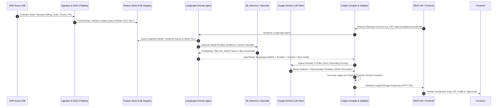

# Dokumentasi Sistem Analisis & Kecerdasan Buatan (ERP Intelligence System)

Dokumen ini memuat spesifikasi komprehensif mengenai **sistem analisis**, **teknik analisis**, **objek yang dianalisis**, serta **proses alur analisis (*end-to-end*)** yang berjalan di dalam ERP Intelligence System.

---

## 1. Filosofi & Paradigma Analisis: Tri-Pillar Intelligence

Sistem analisis ini tidak bergantung pada satu metode tunggal (bukan semata-mata teks LLM dan bukan sekadar kalkulasi dashboard tradisional). Sistem beroperasi di atas kerangka kerja **Tri-Pillar Intelligence**:

```
                  ┌──────────────────────────────────────────────────────────┐
                  │                 TRI-PILLAR INTELLIGENCE                  │
                  └────────────────────────────┬─────────────────────────────┘
                                               │
         ┌─────────────────────────────────────┼─────────────────────────────────────┐
         ▼                                     ▼                                     ▼
 ┌──────────────────────┐          ┌──────────────────────┐          ┌──────────────────────┐
 │       PILAR 1        │          │       PILAR 2        │          │       PILAR 3        │
 │  Fakta Deterministik │          │   Sinyal Prediktif   │          │  Sintesis Kognitif   │
 │   & Statistik SQL    │          │     ML & Domain      │          │     Penalaran LLM    │
 ├──────────────────────┤          ├──────────────────────┤          ├──────────────────────┤
 │ • Agregasi Faktur    │          │ • XGBoost Churn Model│          │ • Google Gemini LLM  │
 │ • Realisasi Kas & AR │          │ • TreeSHAP Explainers│          │ • Eksekutif Summary  │
 │ • Saldo Fisik Gudang │          │ • Depletion Runway   │          │ • Akar Penyebab Masalah│
 │ • Telemetri POP Site │          │ • OTD Vendor Scoring │          │ • Preskripsi Solusi  │
 │ • Tabel Audit Mentah │          │ • MTTR Survival Risk │          │ • Anti-Halusinasi    │
 └──────────┬───────────┘          └──────────┬───────────┘          └──────────┬───────────┘
            │                                 │                                 │
            └─────────────────────────────────┼─────────────────────────────────┘
                                              ▼
                             ┌──────────────────────────────────┐
                             │       INSIGHT PACKAGE (JSON)     │
                             │  KPI + Charts + Audit + Narasi   │
                             └──────────────────────────────────┘
```

1. **Pilar 1: Fakta Deterministik & Statistik Terverifikasi (Data Warehouse)**:
   - Menghasilkan angka metrik absolut dari database transaksional (tanpa aproksimasi probabilistik).
   - Menyediakan tabel audit transaksi mentah (*raw tabular records*) agar seluruh angka total dapat diverifikasi oleh manusia (*human-in-the-loop auditability*).
2. **Pilar 2: Sinyal Prediktif Machine Learning & Heuristik Matematika Domain**:
   - Memproyeksikan risiko masa depan (probabilitas churn pelanggan, hari menuju kehabisan stok, risiko keterlambatan vendor).
   - Membongkar pendorong utama risiko melalui teknik *Explainable AI* (TreeSHAP).
3. **Pilar 3: Sintesis Kognitif & Rekomendasi Preskriptif (LLM - Google Gemini)**:
   - Menghubungkan titik-titik anomali antar departemen menjadi narasi bisnis yang mudah dipahami direksi.
   - Memberikan rekomendasi tindakan taktis dan strategis berbobot prioritas (*severity: info, warning, critical*).

---

## 2. Alur Proses Analisis End-to-End (The Analysis Lifecycle)

Berikut adalah urutan tahapan yang dilalui sistem mulai dari ekstraksi basis data ERP hingga menjadi wawasan siap konsumsi:



---

## 3. Rincian Tiga Mesin Analisis Utama

Sistem ini mengkombinasikan tiga mesin analitik dengan karakteristik komputasi yang berbeda:

### 3.1 Mesin Machine Learning (ML & MLOps Pipeline)

Diterapkan secara penuh (*end-to-end*) pada domain **Commercial** untuk mitigasi risiko pendapatan (*Revenue Protection*).

* **Algoritma**: **XGBoost Classifier (`customer_churn_xgb_v1`)**.
* **Target Prediksi**: Memprediksi apakah pelanggan ISP korporat/ritel berisiko memutus layanan (*churn*) dalam rentang waktu **30–90 hari ke depan**.
* **Fitur Input (*Feature Vector*)**:
  - `billing_delay_avg`: Rata-rata hari keterlambatan pembayaran faktur dalam 6 bulan terakhir.
  - `billing_delay_acceleration`: Deviasi laju keterlambatan tagihan bulan terakhir terhadap riwayat rata-rata.
  - `consecutive_delayed_months`: Jumlah bulan berturut-turut pelanggan membayar terlambat.
  - `arpu`: *Average Revenue Per User* (nilai rata-rata tagihan bulanan).
  - `tenure_months`: Masa berlangganan pelanggan dalam bulan.
  - `payment_trend_category`: Kategori tren disiplin pembayaran (`IMPROVING`, `STABLE`, `WORSENING`).
  - `has_unresolved_complaints`: Indikator boolean jika ada keluhan teknis belum terselesaikan.
* **Preprocessing Pipeline (`preprocessor.py`)**:
  - *Numeric*: Median Imputation + StandardScaler.
  - *Categorical*: Most-frequent Imputation + Ordinal Encoding.
  - *Boolean*: Zero Imputation + Int64 casting.
* **Explainable AI (TreeSHAP via `explainer.py`)**:
  - Tidak hanya menghasilkan angka probabilitas (e.g. `0.84`), tetapi membongkar kontribusi tiap variabel (*SHAP value*).
  - Menghasilkan faktor pendorong spesifik (contoh: *"Keterlambatan pembayaran meningkat 14 hari dibanding kuartal sebelumnya"*).
* **Storage & Idempotensi**:
  - Hasil inferensi disimpan di tabel database `feature_store.prediction_customer_churn` menggunakan mekanisme `ON CONFLICT DO UPDATE` (idempoten per snapshot date dan customer).

---

### 3.2 Mesin Analisis Statistik, Deterministik, & Heuristik Domain

Untuk modul bisnis selain Commercial, sistem menjalankan model matematika dan analisis statistik berbasis aturan industri telekomunikasi/ISP:

#### A. Executive Overview (`/dashboard/overview`)
* **Metode**: *Composite Multi-Criteria Weighted Scoring*.
* **Formula**:
  $$\text{Operational Health Index} = w_1 \cdot \text{FinHealth} + w_2 \cdot \text{CommHealth} + w_3 \cdot \text{ProcHealth} + w_4 \cdot \text{InvHealth} + w_5 \cdot \text{AssetHealth} + w_6 \cdot \text{ServiceHealth}$$
* **Tujuan**: Memberikan skor tunggal (0–100) kepada C-level untuk mengevaluasi stabilitas operasional seluruh divisi secara instan.

#### B. Finance (`/insights/finance`)
* **Metode**: *Accounts Receivable (AR) Aging Bucketing & Cashflow Velocity*.
* **Logika Analisis**:
  - Memisahkan total faktur tertunggak menjadi 3 ember umur: `0–30 Hari` (Lancar), `31–60 Hari` (Dalam Perhatian), dan `> 60 Hari` (Kritis / Gagal Bayar).
  - Menghitung *Collection Efficiency*:
    $$\text{Collection Efficiency} = \frac{\text{Total Kas Masuk Terkoleksi}}{\text{Total Tagihan Jatuh Tempo}} \times 100\%$$
  - Memproyeksikan kecukupan kas operasional (*net cashflow*) terhadap beban operasional berjalan.

#### C. Procurement (`/insights/procurement`)
* **Metode**: *Lead Time Variance & Supplier Reliability (OTD) Scoring*.
* **Logika Analisis**:
  - Membandingkan *Target Arrival Date* vs *Actual Receipt Date* pada seluruh Purchase Order (PO).
  - Menghitung rasio pemenuhan tepat waktu vendor (*On-Time Delivery Rate*):
    $$\text{OTD Rate} = \frac{\text{Jumlah PO Tepat Waktu}}{\text{Total PO Selesai}} \times 100\% \quad (\text{Target: } \ge 90\%)$$
  - Menandai vendor berisiko tinggi yang memiliki deviasi lead time rata-rata $> 14$ hari.

#### D. Inventory (`/insights/inventory`)
* **Metode**: *Burn-Rate & Depletion Curve Forecasting*.
* **Logika Analisis**:
  - Mengukur rata-rata konsumsi material harian (*daily consumption rate*) untuk barang kritis (Kabel Drop Core, Patchcord, SFP, ONT).
  - Menghitung *Stockout Runway (Hari Ketahanan)*:
    $$\text{Runway (Hari)} = \frac{\text{Stok Fisik Tersedia}}{\text{Rata-rata Konsumsi Harian}}$$
  - Deteksi ambang batas aman (*Safety Stock Threshold*): Jika runway $\le 14$ hari, sistem memicu peringatan *critical stockout risk*.

#### E. Asset (`/insights/asset`)
* **Metode**: *Hardware Telemetry Thresholding & Predictive Maintenance Heuristics*.
* **Logika Analisis**:
  - Memantau parameter telemetri perangkat jaringan di shelter/POP (suhu lingkungan shelter, tegangan rectifier, utilisasi port OLT).
  - Menghitung proporsi aset sehat:
    $$\text{Healthy Asset Ratio} = \frac{\text{Aset Normal}}{\text{Total Unit Aset Aktif}} \times 100\%$$
  - Mendeteksi anomali suhu $> 35^\circ\text{C}$ pada shelter fiber optik sebagai pemicu rekomendasi pemeliharaan preventif pendingin (*HVAC*).

#### F. Service / NOC (`/insights/service`)
* **Metode**: *SLA Breach Survival Analysis & MTTR Tracking*.
* **Logika Analisis**:
  - Mengukur *Mean Time to Resolve* (MTTR):
    $$\text{MTTR} = \frac{\sum \text{Durasi Penyelesaian Tiket}}{\text{Jumlah Tiket Selesai}} \quad (\text{Target: } \le 3.0 \text{ Jam})$$
  - Menghitung rasio kepatuhan SLA:
    $$\text{SLA Compliance} = \frac{\text{Tiket Selesai Sesuai SLA}}{\text{Total Tiket Gangguan}} \times 100\% \quad (\text{Target: } \ge 95\%)$$
  - Mengelompokkan penyebab gangguan (*Root Cause Clustering*): Fiber Cut, Power Outage, Hardware Fault, degradasi sinyal optik.

---

### 3.3 Mesin Generative AI & LLM (Google Gemini)

Large Language Model bertindak sebagai **lapisan penalaran (*reasoning layer*)**, bukan pencari fakta numerik.

* **Model yang Digunakan**: `gemini-1.5-flash` / `gemini-1.5-pro` (via Google Gemini REST API).
* **Teknik Prompting**:
  - **Tri-Pillar Injected Prompting**: LLM dilarang berhalusinasi atau mengarang angka. Seluruh data metrik, prediksi ML, riwayat waktu, dan anomali disuntikkan ke dalam *system context*.
  - **Strict JSON Contract Output**: LLM dipandu untuk selalu menghasilkan format JSON yang tervalidasi skema Pydantic (`InsightPackage`).
* **Fungsi Analisis LLM**:
  1. Merumuskan **Executive Summary** (2–3 kalimat intisari situasi bisnis).
  2. Menyusun **Narrative Insights** terstruktur dengan atribut:
     - `id`: Kode wawasan unik.
     - `severity`: Tingkat urgensi (`info`, `warning`, `critical`).
     - `title`: Judul temuan masalah operasional.
     - `narrative`: Penjelasan logis mengapa anomali tersebut terjadi.
     - `suggested_actions`: Langkah korektif konkret yang dapat dieksekusi tim lapangan/manajemen.
* **Deterministic Fallback Engine (`llm_client.py`)**:
  - Jika jaringan terputus, API Gemini mengalami *rate limit*, atau kuota habis, compiler secara otomatis beralih ke generator narasi deterministik (*rule-based fallback*) yang merefleksikan metrik riil secara akurat tanpa membuat sistem crash atau menghasilkan respons kosong.

---

## 4. Matriks Komparatif Objek Analisis Seluruh Modul

Tabel berikut merangkum cakupan objek data, metode analitik, metrik utama, dan tabel audit untuk masing-masing domain:

| Modul / Domain | Objek Data yang Dianalisis | Metode / Algoritma Utama | Metrik Utama (KPI Cards) | Visualisasi Deklaratif (Vega-Lite) | Rincian Tabel Audit BI (Audit Table) |
|---|---|---|---|---|---|
| **Overview** | Konsolidasi performa 6 divisi ISP | Multi-Criteria Composite Scoring | • Indeks Kesehatan (0-100)<br>• MRR Total<br>• Net Cashflow<br>• Kepatuhan SLA<br>• Peringatan Kritis | `chart-domain-health` (Bar skor kesehatan komparatif 6 unit) | Ringkasan kinerja komparatif 6 unit bisnis beserta deviasi target |
| **Commercial** | Akun pelanggan, riwayat pembayaran, paket bandwidth, billing | Supervised ML (XGBoost) + TreeSHAP XAI + Time-Series | • Monthly Recurring Revenue<br>• Pelanggan Risiko Tinggi<br>• Pelanggan Aktif<br>• ARPU | `chart-churn-distribution` & `chart-billing-delay-trend` | Portofolio akun pelanggan berisiko tinggi (Probabilitas %, Driver Risiko) |
| **Finance** | Faktur piutang pelanggan, pembayaran kas, termin kredit | AR Aging Bucket Analysis & Cash Velocity | • Net Operating Cashflow<br>• Total Piutang Beredar<br>• Rasio Piutang > 60 Hari<br>• Efisiensi Penagihan | `chart-ar-aging` (Donut chart komposisi umur piutang) | Buku besar faktur piutang (No Faktur, Nama Klien, Hari Telat, Status) |
| **Procurement** | Purchase Order (PO), data vendor, tanggal ETA vs kedatangan | Lead Time Variance & Vendor Reliability Scoring | • Rata-rata Lead Time (Hari)<br>• Vendor Risiko Keterlambatan<br>• Rasio On-Time Delivery | `chart-vendor-performance` (Bar skor OTD vendor vs target 90%) | Daftar rekam jejak Purchase Order pengadaan perangkat |
| **Inventory** | Saldo fisik stok material gudang, laju konsumsi teknisi | Burn-Rate Modeling & Runway Depletion Projection | • SKU Berisiko Stockout<br>• Total Nilai Aset Gudang<br>• Runway Cadangan (Hari) | `chart-stock-depletion` (Line chart tren penurunan vs batas aman) | Saldo material kritis gudang (Kode SKU, Stok Fisik, Konsumsi, Sisa Hari) |
| **Asset** | Perangkat keras POP (OLT, router, switch), telemetri sensor shelter | Sensor Thresholding & Predictive Maintenance Classification | • Perangkat Perlu Servis<br>• Rasio Aset Prima (%)<br>• Nilai Depresiasi Berjalan | `chart-asset-health` (Distribusi kondisi perangkat: Prima, Servis, Kritis) | Detail status operasional hardware POP (ID Aset, Suhu, Voltase, Servis) |
| **Service (NOC)**| Tiket insiden jaringan (*trouble tickets*), log penanganan tim lapangan | Incident MTTR Tracking & SLA Survival Analysis | • Kepatuhan SLA (%)<br>• Rata-rata MTTR (Jam)<br>• Total Tiket NOC Aktif | `chart-ticket-sla` (Grouped bar tiket terpenuhi vs dilanggar per kategori) | Log tiket aktif NOC (ID Tiket, Kategori Gangguan, Durasi, Teknisi, SLA) |

---

## 5. Kontrak Output Analisis: `InsightPackage`

Seluruh hasil analisis (baik yang berasal dari SQL, XGBoost, maupun Gemini LLM) dibungkus dalam format seragam yang divalidasi oleh skema Pydantic [`backend/app/schemas/insights.py`](file:///Users/rio/Documents/RIO/KULIAH/KP/project/backend/app/schemas/insights.py):

```json
{
  "module": "commercial",
  "as_of_date": "2026-09-05",
  "executive_summary": "Pertumbuhan MRR tercatat positif sebesar Rp 1.45 M, namun terdeteksi 8 pelanggan korporat dengan probabilitas churn tinggi akibat deviasi penundaan pembayaran berulang.",
  "key_metrics": [
    {
      "key": "mrr",
      "label": "Monthly Recurring Revenue",
      "value": 1450000000.0,
      "formatted_value": "Rp 1.45 M",
      "unit": "IDR",
      "change_percentage": 3.2,
      "trend": "up",
      "status": "good"
    }
  ],
  "narrative_insights": [
    {
      "id": "ins-comm-001",
      "domain": "commercial",
      "severity": "warning",
      "title": "Akselerasi Keterlambatan Pembayaran Pelanggan Korporat",
      "narrative": "Analisis TreeSHAP mengidentifikasi bahwa variabel billing_delay menyumbang 62% terhadap skor risiko churn pada 8 akun tier Enterprise di wilayah Jakarta Pusat.",
      "suggested_actions": [
        "Jadwalkan rekonsiliasi termin pembayaran dengan bagian procurement klien.",
        "Tawarkan program retensi restrukturisasi tagihan tahunan."
      ]
    }
  ],
  "visualizations": [
    {
      "chart_id": "chart-churn-distribution",
      "title": "Distribusi Segmentasi Risiko Pelanggan",
      "chart_library": "vega-lite",
      "spec": { "$schema": "https://vega.github.io/schema/vega-lite/v5.json", "...": "..." }
    }
  ],
  "audit_table": {
    "title": "Audit Portofolio Risiko Pelanggan (XGBoost Churn Profiling)",
    "description": "Daftar akun pelanggan, estimasi probabilitas churn, dan pendorong risiko utama",
    "columns": [
      { "key": "customer_id", "label": "ID Akun", "type": "text" },
      { "key": "customer_name", "label": "Nama Pelanggan", "type": "text" },
      { "key": "churn_probability", "label": "Probabilitas Churn", "type": "percentage" },
      { "key": "risk_level", "label": "Tingkat Risiko", "type": "badge" }
    ],
    "rows": [
      {
        "customer_id": "CUST-1001",
        "customer_name": "PT Sinergi Abadi Maju",
        "churn_probability": "84.2%",
        "risk_level": "HIGH"
      }
    ],
    "total_records": 1
  },
  "model_metadata": [
    {
      "model_name": "customer_churn_xgb_v1",
      "version": "1.0.0",
      "prediction_window": "30_days",
      "confidence_score": 0.88,
      "last_trained_at": "2026-09-05T08:30:00Z"
    }
  ],
  "generated_at": "2026-09-05T09:30:00Z"
}
```

---

## 6. Lokasi File Implementasi Kode Analisis

Untuk meninjau kode sumber (*source code*) masing-masing komponen:

| Komponen Analisis | File Implementasi Kode |
|---|---|
| Skema Output & Audit Data | [`backend/app/schemas/insights.py`](file:///Users/rio/Documents/RIO/KULIAH/KP/project/backend/app/schemas/insights.py) |
| Orkestrator Analisis & Assembly | [`backend/app/insights/compiler.py`](file:///Users/rio/Documents/RIO/KULIAH/KP/project/backend/app/insights/compiler.py) |
| Model Machine Learning (XGBoost) | [`backend/app/ml/models/churn_xgboost.py`](file:///Users/rio/Documents/RIO/KULIAH/KP/project/backend/app/ml/models/churn_xgboost.py) |
| Explainable AI (TreeSHAP) | [`backend/app/ml/inference/explainer.py`](file:///Users/rio/Documents/RIO/KULIAH/KP/project/backend/app/ml/inference/explainer.py) |
| Service Inferensi Batch ML | [`backend/app/ml/inference/churn_predictor.py`](file:///Users/rio/Documents/RIO/KULIAH/KP/project/backend/app/ml/inference/churn_predictor.py) |
| Mesin Visualisasi Vega-Lite v5 | [`backend/app/insights/chart_generator.py`](file:///Users/rio/Documents/RIO/KULIAH/KP/project/backend/app/insights/chart_generator.py) |
| Klien Kognitif LLM (Google Gemini) | [`backend/app/insights/llm_client.py`](file:///Users/rio/Documents/RIO/KULIAH/KP/project/backend/app/insights/llm_client.py) |
| State Machine Agen Multi-Domain | [`backend/app/agents/base.py`](file:///Users/rio/Documents/RIO/KULIAH/KP/project/backend/app/agents/base.py) & [`backend/app/agents/state.py`](file:///Users/rio/Documents/RIO/KULIAH/KP/project/backend/app/agents/state.py) |
| Guardrail & Sanitizer Validasi | [`backend/app/insights/validator.py`](file:///Users/rio/Documents/RIO/KULIAH/KP/project/backend/app/insights/validator.py) |
